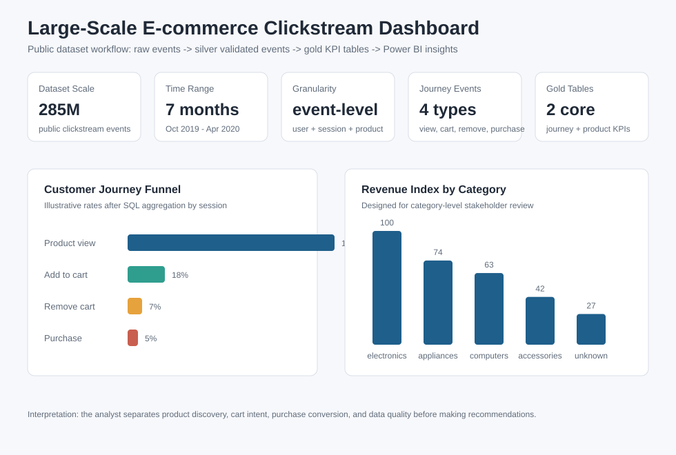
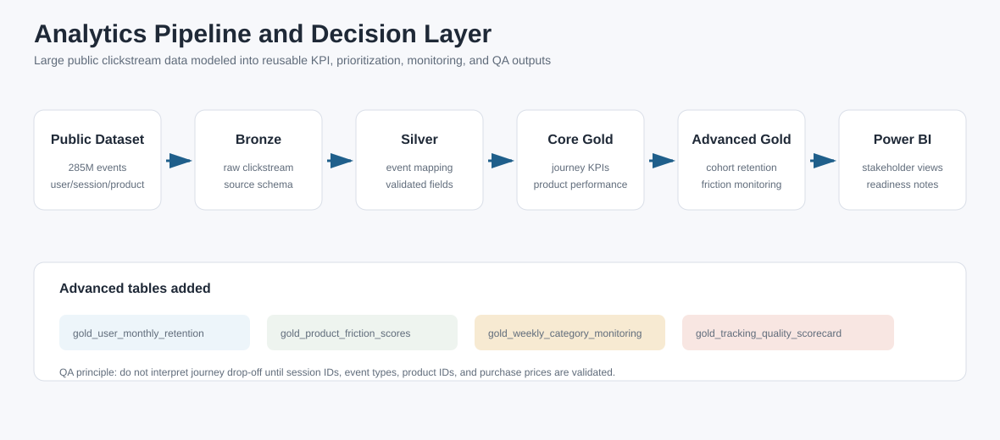

# Web Analytics Portfolio

An end-to-end e-commerce web analytics project demonstrating how raw tracking data can become reliable business KPIs and Power BI-ready reporting tables.

```text
tracking plan -> raw web events -> cleaned validated events -> gold KPI tables -> Power BI dashboard insights
```

This repository uses public-safe sample data so the methodology can be shared without exposing private business data, customer records, credentials, or production source code.

## Visual Outputs





## Project Entry Points

| Area | File | What it shows |
|---|---|---|
| Project summary | [Project overview](docs/project_overview.md) | Structure, scope, and analytical capabilities demonstrated |
| Web tracking | [Matomo tracking plan](docs/matomo_tracking_plan.md) | How Matomo events can be defined, validated, and modeled |
| Business case | [Web funnel case study](docs/case_study_web_funnel.md) | End-to-end explanation of the funnel analysis case |
| SQL KPI logic | [Funnel KPI SQL](sql/03_create_gold_funnel_kpis.sql) | Session-level funnel modeling by channel and device |
| Data quality | [Data quality SQL](sql/05_data_quality_checks.sql) | Checks before using dashboard results |
| Dashboard design | [Power BI dashboard design](powerbi/dashboard_design.md) | Power BI report structure, example visuals, and DAX measures |
| Visual generation | [Visual generation script](scripts/generate_portfolio_visuals.py) | Reproducible dashboard-style images from sample event data |
| Project explanation | [Project walkthrough](docs/project_walkthrough.md) | How the project connects tracking, SQL, KPIs, and dashboards |

## Why This Project

The goal is to show how I approach a web analytics problem: define reliable events, validate raw tracking data, model it into clean analytical tables, and prepare KPI outputs for dashboards and stakeholder decisions.

This project covers:

- web analytics
- marketing and product analytics
- e-commerce funnel analysis
- Databricks / SQL analytics workflows
- Power BI reporting
- data QA, validation, and KPI definition
- stakeholder-facing insights

## Business Context

An e-commerce team wants to understand how visitors move through the digital shopping journey:

1. Product view
2. Add to cart
3. Begin checkout
4. Purchase

The goal is to identify funnel drop-off, compare performance across channels and devices, and create reliable KPI tables for dashboarding.

## Analytical Capabilities Demonstrated

| Capability | Evidence in this project |
|---|---|
| Web analytics | Event taxonomy and Matomo tracking plan |
| SQL and Databricks-style analytics | Bronze, silver, and gold SQL scripts |
| Power BI reporting | Dashboard design, visual examples, and DAX measure examples |
| Stakeholder insight | Business questions, case study, and KPI definitions |
| Data quality | Dedicated QA SQL checks before reporting |
| Commercial analysis | Funnel, channel, device, product, and revenue analysis |

## Tools and Concepts

- Databricks SQL
- Medallion-style data modeling
- Bronze raw data
- Silver cleaned event data
- Gold business KPI tables
- Data QA and validation
- Power BI dashboard design
- Matomo web analytics instrumentation planning
- Google Analytics e-commerce event conventions

## Repository Structure

```text
data/
  raw_web_events_sample.csv
  products_sample.csv

sql/
  01_create_bronze_tables.sql
  02_create_silver_clean_events.sql
  03_create_gold_funnel_kpis.sql
  04_create_gold_product_performance.sql
  05_data_quality_checks.sql

docs/
  project_overview.md
  project_walkthrough.md
  case_study_web_funnel.md
  event_taxonomy.md
  matomo_tracking_plan.md
  dashboard_screenshots/

powerbi/
  dashboard_design.md

scripts/
  generate_portfolio_visuals.py
```

## How to Run

1. Open Databricks SQL Editor or a SQL notebook.
2. Run `sql/01_create_bronze_tables.sql` to create sample bronze tables.
3. Run `sql/02_create_silver_clean_events.sql` to create cleaned event data.
4. Run `sql/03_create_gold_funnel_kpis.sql` to create daily funnel KPIs.
5. Run `sql/04_create_gold_product_performance.sql` to create product-level KPIs.
6. Run `sql/05_data_quality_checks.sql` to inspect data quality issues.

The SQL scripts are designed to be readable and review-friendly. The first script includes an inline sample-data setup so the project can be reviewed without external systems.

## Key Questions

- Which channels drive the most product views and purchases?
- Where does the funnel lose users?
- Is the drop-off different on mobile vs desktop?
- Which products have high views but low purchase conversion?
- Can the event data be trusted for reporting?

## Gold KPI Tables

### `gold_daily_funnel_kpis`

Daily funnel metrics by channel and device:

- sessions
- product view sessions
- add-to-cart sessions
- checkout sessions
- purchase sessions
- revenue
- view-to-cart rate
- cart-to-purchase rate
- session conversion rate

### `gold_product_performance`

Product-level performance:

- product views
- add-to-cart sessions
- purchase sessions
- revenue
- view-to-purchase rate

## Data Quality Checks

The project includes checks for:

- duplicate event IDs
- missing session IDs
- product events without product IDs
- purchase events without order IDs
- negative revenue
- invalid funnel ordering

## Dashboard Pages

The Power BI dashboard is designed with four pages:

1. Executive Overview
2. E-commerce Funnel
3. Product Performance
4. Channel and Device Analysis

See [powerbi/dashboard_design.md](powerbi/dashboard_design.md) for the dashboard layout, example visuals, and DAX measure examples.

## Summary

This project demonstrates an end-to-end web analytics workflow: define event taxonomy and business KPIs, validate raw event data, transform it into cleaned silver tables, and create gold KPI tables that can support dashboards and stakeholder decisions.
