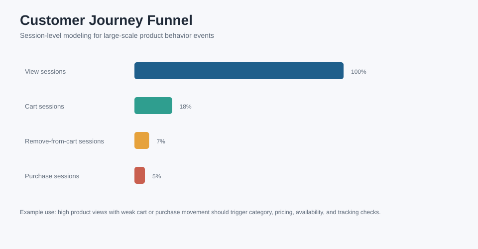
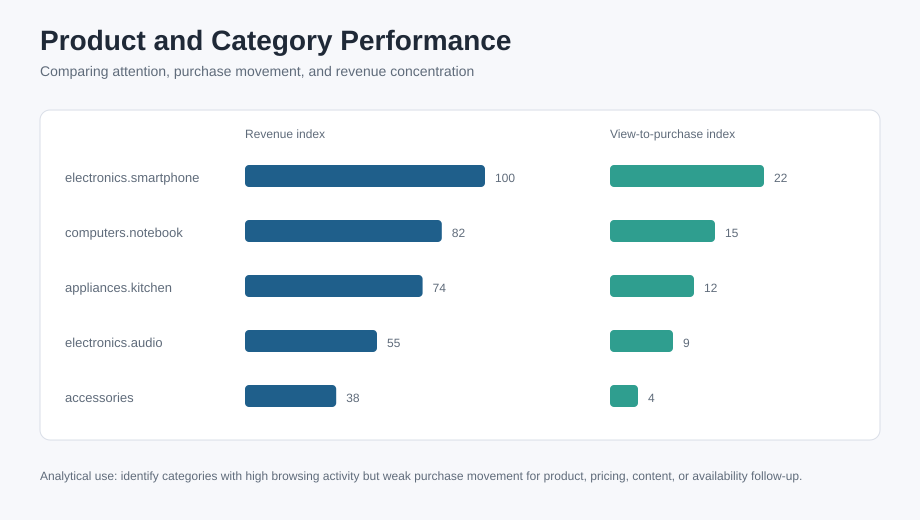

# Power BI Dashboard Design

This dashboard is designed from the gold KPI tables produced by the Databricks SQL scripts for a large-scale public e-commerce clickstream dataset.

The design goal is to support stakeholder conversations about customer journey behavior and product/category performance. The selected dataset does not contain traffic source or device fields, so channel attribution should not be shown unless those fields are added from another source.

## Example Dashboard Output

The visuals below show the intended reporting output for the large-scale clickstream project.






## Data Sources

Recommended model tables:

- `gold_daily_journey_kpis`
- `gold_product_performance`
- `silver_clean_events`

Suggested relationships:

```text
gold_product_performance.product_id -> product dimension, if a separate product dimension is available
gold_daily_journey_kpis.category_code -> category dimension, if available
```

## Page 1: Executive Overview

Purpose: give stakeholders a quick view of event volume, journey movement, conversion, and revenue.

Business question:

> Are users moving from product discovery to cart and purchase, and which categories explain the performance?

Recommended visuals:

- KPI card: total events
- KPI card: sessions
- KPI card: users
- KPI card: purchase sessions
- KPI card: revenue
- Line chart: sessions and purchase sessions by date
- Bar chart: revenue by category
- Table: category, sessions, cart sessions, purchase sessions, revenue, conversion

Recommended filters:

- date
- event type
- category
- brand
- price range

## Page 2: Customer Journey Funnel

Purpose: identify where users drop off.

Business question:

> Which journey step creates the biggest loss of user intent?

Recommended visuals:

- Funnel chart:
  - view sessions
  - cart sessions
  - purchase sessions
- Bar chart: view-to-cart rate by category
- Bar chart: cart-to-purchase rate by category
- Table: daily journey KPIs

Example interpretation:

```text
If a category has high view volume but weak cart or purchase conversion, the next step is to inspect product relevance, pricing, availability, product page content, and tracking completeness.
```

## Page 3: Product Performance

Purpose: understand product-level attention, intent, and revenue.

Business question:

> Which products attract interest but fail to convert?

Recommended visuals:

- Table: product ID, category, brand, views, cart sessions, purchase sessions, revenue, view-to-purchase rate
- Bar chart: revenue by product/category
- Scatter plot: view sessions vs purchase sessions
- Conditional formatting: high view / low purchase products

Example interpretation:

```text
High views with low purchase conversion may indicate pricing, product content, availability, shipping expectations, or checkout friction.
```

## Page 4: Category and Brand Analysis

Purpose: compare product groups and identify where business teams should investigate.

Business question:

> Which categories and brands create revenue, and which only create browsing activity?

Recommended visuals:

- Matrix: category x brand with sessions, revenue, conversion
- Bar chart: revenue by category
- Bar chart: view-to-purchase rate by brand
- Table: top products by revenue and top products by under-conversion

## Measures to Create in Power BI

Example DAX measures:

```text
Total Sessions = SUM(gold_daily_journey_kpis[sessions])
Total Users = SUM(gold_daily_journey_kpis[users])
View Sessions = SUM(gold_daily_journey_kpis[view_sessions])
Cart Sessions = SUM(gold_daily_journey_kpis[cart_sessions])
Purchase Sessions = SUM(gold_daily_journey_kpis[purchase_sessions])
Total Revenue = SUM(gold_daily_journey_kpis[revenue])
View To Cart Rate = DIVIDE([Cart Sessions], [View Sessions])
Cart To Purchase Rate = DIVIDE([Purchase Sessions], [Cart Sessions])
Session Conversion Rate = DIVIDE([Purchase Sessions], [Total Sessions])
Revenue Per Purchase Session = DIVIDE([Total Revenue], [Purchase Sessions])
```

## Dashboard QA Checklist

Before sharing the dashboard, I would check:

- metric definitions match the SQL gold tables
- filters do not create misleading totals
- purchase revenue uses only purchase events
- conversion rates are displayed as percentages
- category and brand labels are readable
- no chart relies on raw event-level rows when a gold table should be used
- dashboard insights are tied to a suggested next action

## Design Rationale

The dashboard is structured around stakeholder questions rather than chart types: first overall performance, then journey drop-off, then product-level performance, then category and brand differences.

The important analytics habit is to validate event coverage and KPI definitions before presenting funnel movement as a business issue.
